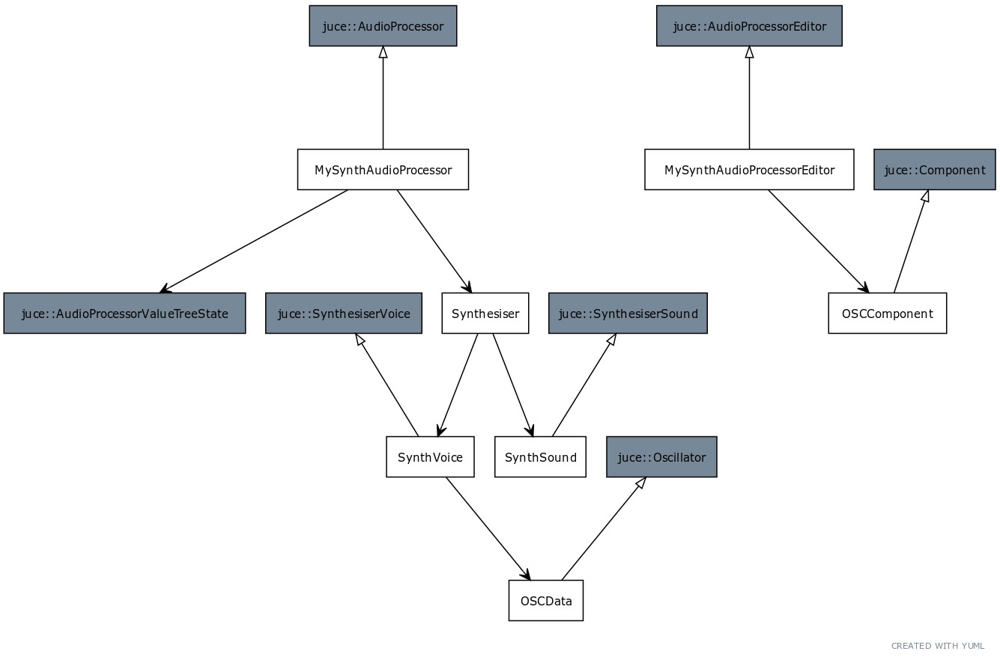

# MySynth

I really regret not getting this under version control sooner...

I've done so much work and witout version control I've got barely anything to show for it

But anyways, enough pouting...

MySynth is a plugin made with the JUCE framework. These files are the source code that accompanies a specific project configuration in order for all of it to load properly so I should document that process for users as well.

I already feel like this is gonna make development much easier and faster being in VSC and under version control.

JUCE's project configs interfere with my ability to structure these files. I'm gonna work on figuring out how to make this look nice.

### Files
 - ADSRComponent.cpp & ADSRComponent.h: This is where the gui for the ADSR is defined. 
 - ADSRData.cpp & ADSRData.h: This is where the Sound is manipulated based on the ADSR parameters
 - OscComponent.cpp & OscComponent.h: This is where the gui for the Oscillator is defined
 - OscData.cpp & OscData.h: This is where the Sound is manipulated based on the Oscillator parameters
 - PluginEditor.cpp & PluginEditor.h: The editor window for my plugin. Components like the Oscillator and ADSR are added to it 
 - PluginProcessor.cpp & PluginProcessor.h: This is the outermost layer of audio generation. Passes a sample to Synth Voice
 - SynthSound.h: Enables the synthesizer to make noise
 - SynthVoice.cpp & SynthVoice.h: Contains the oscillators and ADSR, controls polyphony

## Class Diagram
